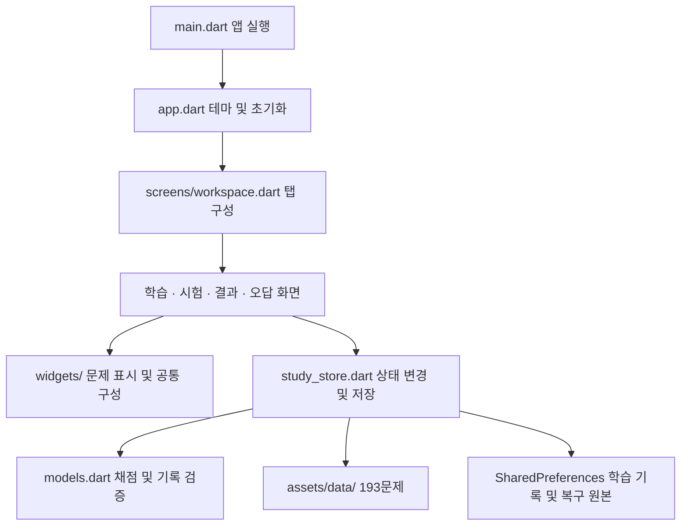

# 소프트웨어 공학 평가 및 수정

평가일: 2026-10-04 · 대상: 차곡 정보처리기사 실기 Flutter 앱

## 평가 결과

학습·시험·오답노트의 주요 기능과 193문제의 자료 구성이 갖춰져 있으나, 기존 정적 분석과 25개 테스트만으로는 채점 정책, 저장 손상, 비동기 화면 전환의 경계 조건을 충분히 확인하지 못했다. 실제 코드를 검토하고 결함을 재현하는 테스트를 추가하여 다음 항목을 수정했다. 기능 요구사항과 뉴모피즘 디자인은 유지했다.

평가 기준은 기능 정확성, 기록의 신뢰성, 상태 무결성, 유지보수성, 저장 성능, 접근성, 개발 재현성이다. 임의의 종합 점수 대신 재현 사례와 검증 결과로 판단했다.

## 발견 사항과 수정

P1은 잘못된 채점·기록 손실·시험 상태 오류를 일으키는 문제, P2는 성능·유지보수·사용 상태 안내를 개선하는 문제로 분류했다.

| 우선순위 | 영역 | 수정 전 문제와 영향 | 적용한 수정 |
| --- | --- | --- | --- |
| P1 | 채점 정확성 | 모든 답안을 소문자로 바꾸고 공백·줄바꿈을 정리하여 `False`/`false`, 두 줄/한 줄 출력까지 같은 답으로 취급했다. | 키워드·SQL 단답과 프로그램 출력의 채점 정책을 구분했다. 출력의 대소문자·내부 공백·줄 경계는 유지하고 CRLF 및 불필요한 끝 공백만 허용한다. |
| P1 | 기록 복구 | 잘못된 저장 항목 하나가 복원 전체를 실패시켜 다른 정상 기록까지 초기화할 수 있었다. | 항목별 검증·부분 복구를 적용했다. 손상된 원문을 별도 복구 보관함에 저장하며, 보관 실패 시 기존 원문을 덮어쓰지 않는다. |
| P1 | 시험 제출 | 제출 확인 창이 열린 채 시간이 만료되면 일반적인 화면 닫기 호출이 다른 창을 닫거나, 오래된 확인 응답이 뒤늦게 시험을 제출할 수 있었다. | 해당 화면이 연 확인 창의 경로만 제거한다. 작업 식별자·현재 시험 객체·화면 생존 여부를 확인하고 중복·오래된 제출을 차단한다. |
| P1 | 상태 무결성 | 저장소 초기화 실패 중 편집, 진행 중 시험 교체, 잘못된 저장 시험 복원에 대한 경계가 불충분했다. | 준비 완료 전 편집과 시험 교체를 차단했다. 중복·알 수 없는 문제 ID, 비정상 날짜·시간·채점 상태를 검증한다. 전달된 문제 객체 대신 저장된 원본 문제로 채점한다. |
| P1 | 시험 시간 | 종료 기한 이후 답안 변경 또는 시스템 시계 후퇴가 비정상 시험 시간·기록을 만들 수 있었다. | 기한 이후 변경을 거부하고 남은 시간을 원래 제한 시간 이내로 한정한다. 답안·종료 시각의 순서를 보정하여 앱이 생성한 기록을 다시 복원할 수 있게 했다. |
| P2 | 저장 성능 | 입력마다 전체 JSON 스냅샷을 저장 큐에 추가하여 저장이 느릴 때 오래된 쓰기가 누적될 수 있었다. | 현재 진행 중 쓰기와 최신 대기 상태만 유지한다. 실제 쓰기 직전에 직렬화하고 `flush()`로 완료를 기다린다. |
| P2 | 저장 안내 | 저장이 끝나기 전에 저장됨을 표시하거나, 실패한 메모를 저장 완료로 안내할 수 있었다. | 저장 중·완료·실패와 재시도를 표시한다. 메모 완료는 실제 쓰기 성공 후 표시하며, 쓰기 도중 바뀐 새 초안은 완료로 표시하지 않는다. |
| P2 | 구조·스크롤 | 약 2,400줄의 진입 파일에 모든 화면이 모여 있었다. 여러 탭이 기본 스크롤 상태를 공유할 여지도 있었다. | 앱 구성, 6개 화면, 공통 위젯을 분리했다. 각 화면에 고유 스크롤 키를 주고 기본 스크롤 컨트롤러 공유를 해제했다. |
| P2 | 접근성 | 선택 가능한 문제·코드·정답과 도표가 접근성 트리에서 누락될 수 있었다. | 텍스트·도표에 의미 정보를 명시했다. 중복 읽기를 막으면서 원래 텍스트 선택 기능을 유지한다. |
| P2 | 개발 재현성 | PDF 추출 도구가 특정 사용자의 절대 경로에 의존했고 자동 검증 파이프라인이 없었다. | `--source-dir`와 입력 검증을 추가했다. SDK·의존성 잠금 파일·액션 커밋을 고정한 CI를 구성하고 실행 방법을 문서화했다. |

## 구조와 책임

채점 정책은 모델에서, 사용자 작업과 기록 변경은 저장소에서, 화면과 비동기 확인 창은 각 화면에서 담당한다. 화면 분리를 위해 새로운 상태 관리 라이브러리나 서버 의존성을 추가하지 않았다. 저장소는 시계와 저장소 로더를 주입할 수 있어 시간 경계와 초기화 실패를 결정적으로 테스트한다.

복구 보관함 `gisa.study.v1.recovery`에는 손상된 저장 문자열의 원본을 중복 없이 누적한다. 이 보관함 자체를 읽을 수 없으면 저장 실패를 표시하고 원문 보존을 위해 덮어쓰기를 차단한다. 이는 기록을 자동 삭제하지 않기 위한 선택이다.

## 검증 결과

검증 환경: Windows, Flutter 3.38.9, Dart 3.10.8. 아래 결과는 로컬에서 실행했다.

| 검사 | 결과 | 확인 범위 |
| --- | --- | --- |
| 정적 분석 | 통과, 지적 사항 0개 | 앱과 테스트의 Dart 정적 분석 |
| 회귀 테스트 | 67개 통과 | 모델·채점 22개, 저장소 29개, UI 16개 |
| 자료 검증 | 통과 | 원본 PDF 8종의 페이지 범위, 193개 고유 문항, 코드 46문제, PNG 도표 6개, 알려진 추출 예외 |
| 답안 정책 | 통과 | 193문제의 모범답안·명시적 별칭과 수동 채점 정책, 대소문자·공백·줄 경계의 오답 변형 |
| 웹·Android 빌드 | 통과 | 최신 코드로 배포용 웹과 개인 설치용 release APK(54.9MB) 생성 |
| 웹 화면 확인 | 통과 | 새 빌드의 저장 완료 표시, 문제·코드·정답의 접근성 정보, 뉴모피즘 화면 배치 |

핵심 회귀 사례는 다음과 같다.

- 정상 기록 옆에 손상된 오답 행이 있어도 북마크·메모·유효한 시험 기록을 복구한다.
- 복구 원본 보관에 실패하면 기존 원문을 덮어쓰지 않으며, 재시도 성공 후 최신 상태를 저장한다.
- 느린 저장 중 여러 번 입력해도 대기 쓰기가 누적되지 않고 마지막 메모를 복원한다.
- 시험 제출을 반복해도 시도·오답 횟수를 한 번만 집계한다.
- 다른 대화상자가 제출 확인 창 위에 있어도 만료 시 제출 확인 창만 닫는다.
- 화면이 사라지거나 시험이 바뀐 뒤 확인 응답이 와도 해당 응답으로 시험을 제출하지 않는다.
- 다른 탭을 보고 있어도 시험 만료가 처리되며, 각 화면의 스크롤 상태는 독립적이다.
- 저장 실패 중 메모는 완료로 표시하지 않고, 저장소가 준비되지 않았으면 학습 화면 진입을 차단한다.

LCOV 실행 행 기준 커버리지는 `models.dart` 254/265행(95.8%), `study_store.dart` 317/330행(96.1%)이다. 수치는 해당 테스트에서 실행된 행의 비율이며, 모든 가능한 입력이나 기기 동작을 검증했다는 뜻은 아니다.

재현 명령은 README에 수록했다. GitHub Actions 구성은 액션의 [소스 체크아웃](https://github.com/actions/checkout) 및 [Flutter 설치](https://github.com/subosito/flutter-action) 인터페이스에 맞췄으며, 로컬에서는 같은 SDK로 분석·테스트·웹 빌드를 검사했다. 원격 CI 실행 결과는 아직 없다.

## 남은 범위

- 기록은 현재 기기의 SharedPreferences에 저장된다. 기기 간 동기화·파일 백업·트랜잭션 저장을 제공하지 않는다. `flush()`는 플러그인 쓰기 결과를 기다리지만 갑작스러운 프로세스 종료까지 영속성을 보장하는 기능은 아니다.
- 서술형·SQL 작성 등 85문제는 사용자가 모범답안과 비교하여 채점한다. 앱이 SQL이나 제출 코드를 실행하여 의미적 동등성을 판단하지 않는다.
- 웹 화면과 위젯 테스트를 검증했으며, Android는 release APK 생성까지 확인한다. 실제 Android 기기 및 iOS·데스크톱 네이티브에서의 설치·실행 검증은 이번 평가에 포함하지 않았다.
- APK의 스토어 배포 서명과 원격 CI 실행은 별도 단계다. 이번 수정의 GitHub push는 수행하지 않았다.
